# NabuAI Architecture Diagrams

This file contains Mermaid diagrams visualizing the system architecture, data flows, and component interactions.

## System Architecture

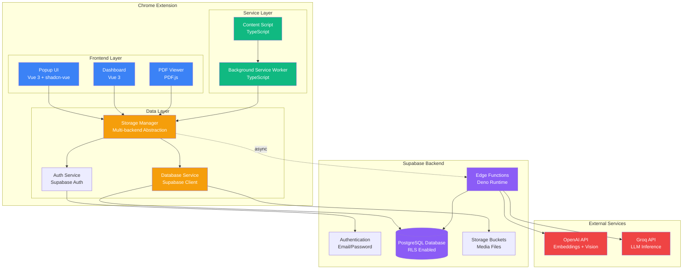

## Data Flow: Content Save

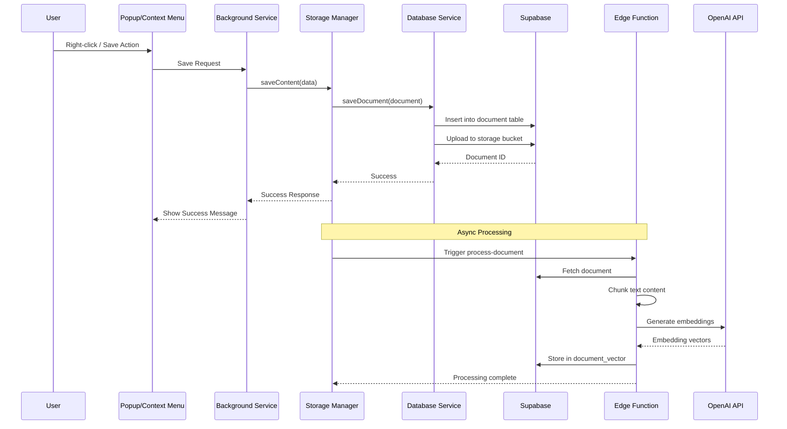

## Data Flow: RAG Chat

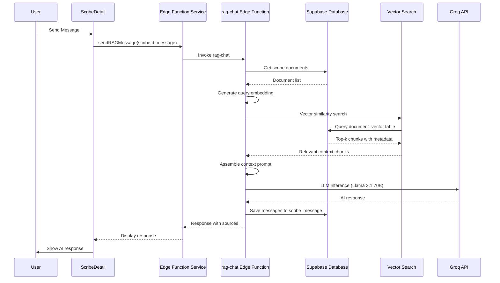

## Component Interaction: PDF Annotation

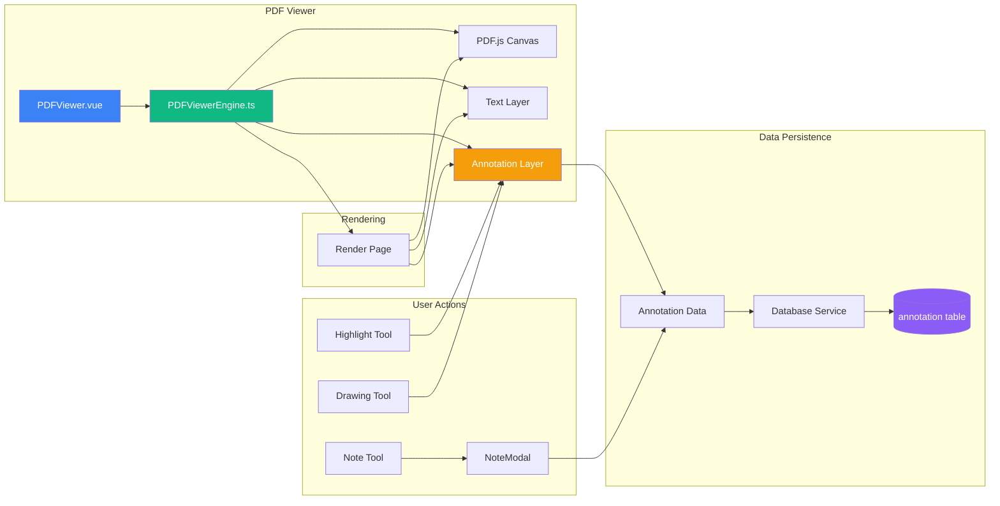

## Database Schema Relationships

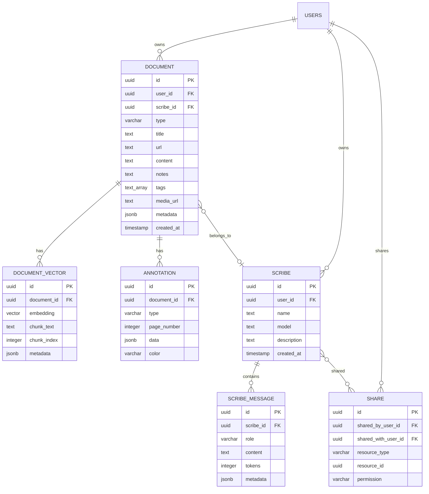

## Vectorization Pipeline

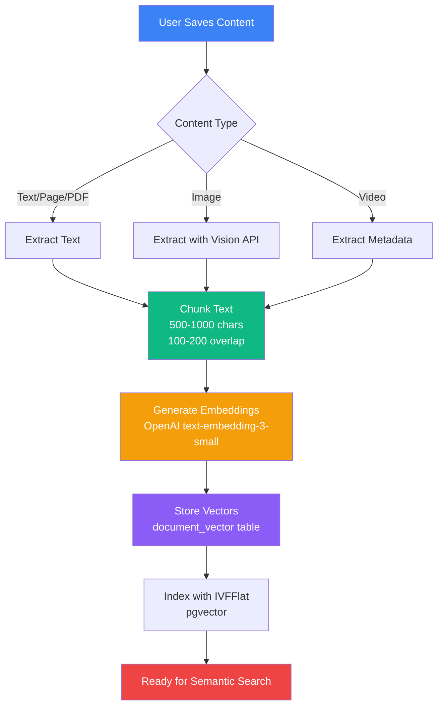

## Authentication Flow

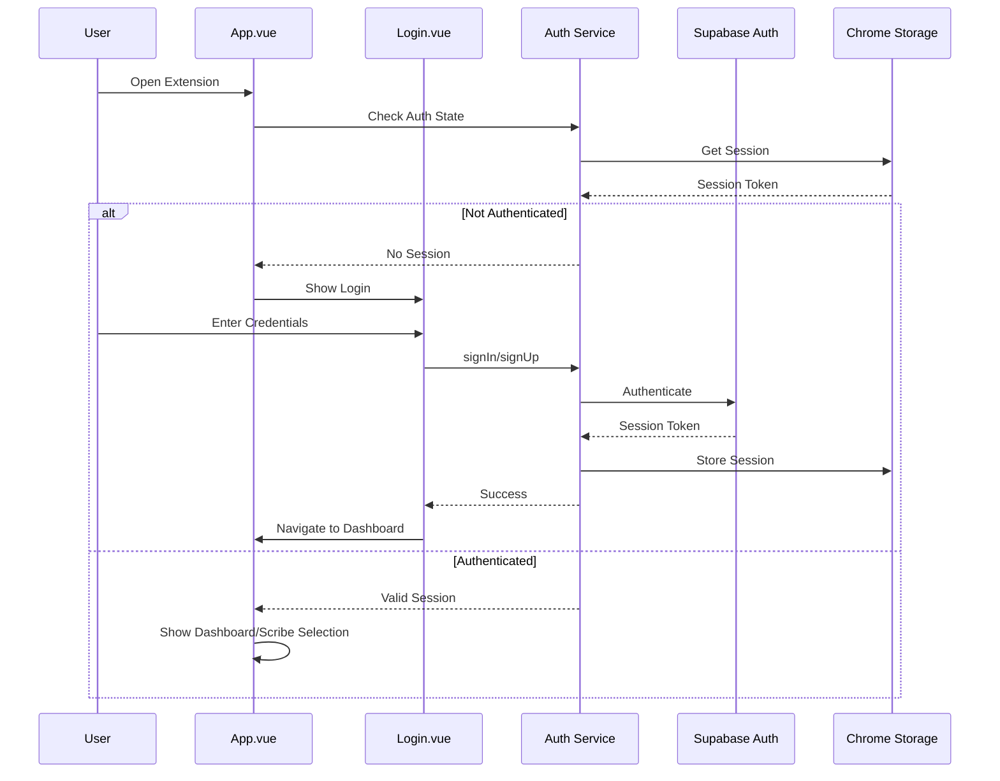

## Edge Functions Architecture

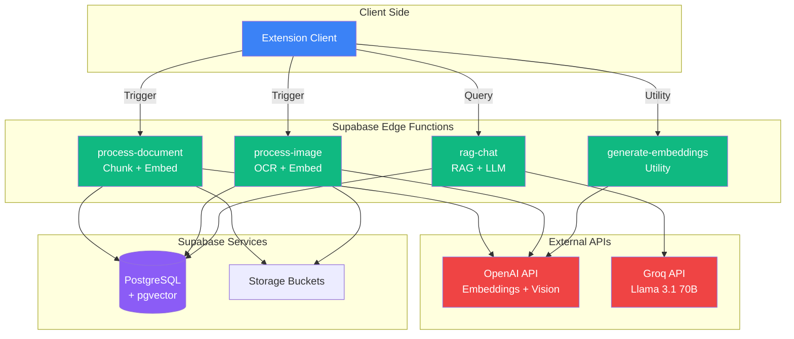

## Storage Backend Abstraction

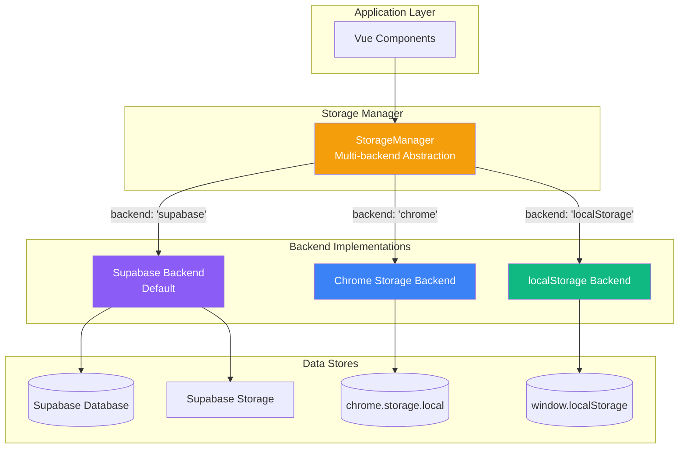

## UI Component Hierarchy

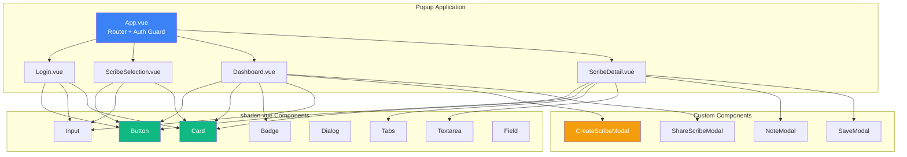

## RAG Query Processing Detail

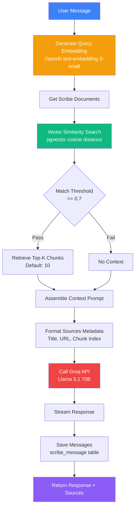

## Context Menu Flow

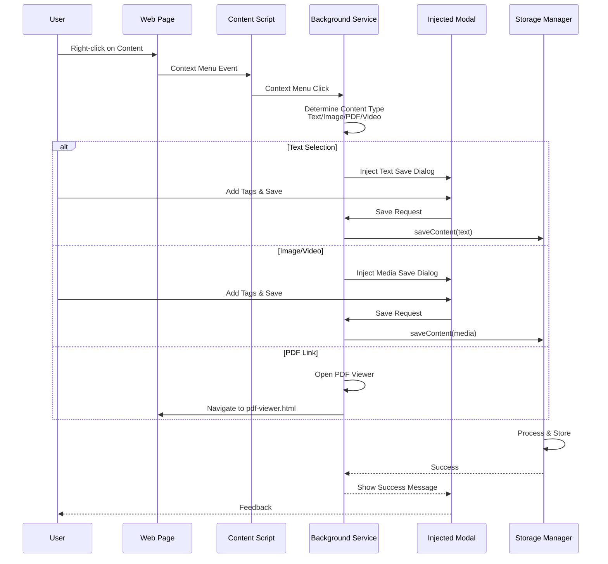

---

## How to View These Diagrams

1. **GitHub/GitLab**: Mermaid diagrams render automatically in markdown files
2. **VS Code**: Install "Markdown Preview Mermaid Support" extension
3. **Online**: Copy diagram code to [Mermaid Live Editor](https://mermaid.live/)
4. **Documentation Sites**: Most support Mermaid (GitBook, Notion, etc.)

## Diagram Legend

- **Blue**: Frontend/UI Components
- **Green**: Service Layer/Processing
- **Orange**: Data/Storage Layer
- **Purple**: Backend Services
- **Red**: External APIs

